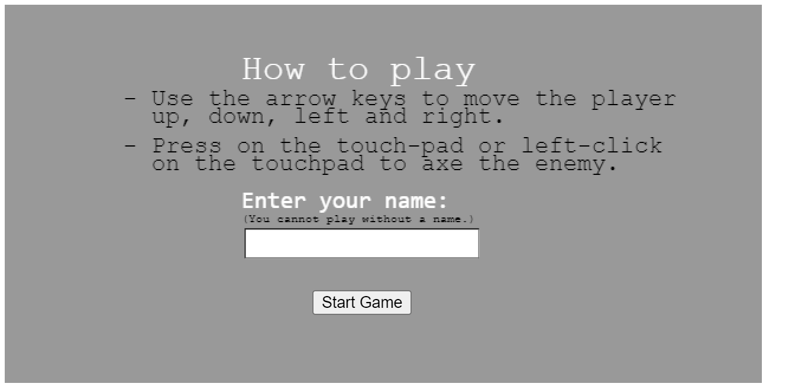
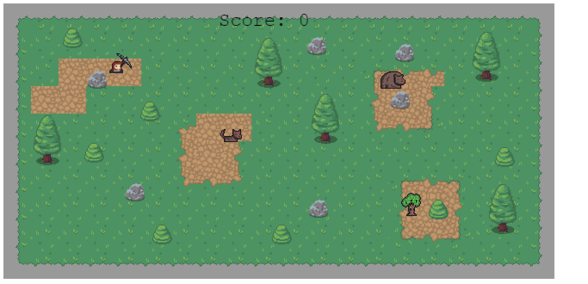
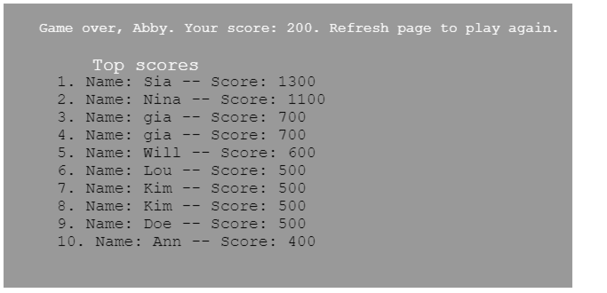

## Survival Game.

 In this game, the player is trying to protect themselves from the enemies who have invaded their property. The player's life is in danger when the enemy detects them. The player only has the axe on their hand to defend themselves.








## Game Design

- The game is built using phaser. It uses the matter physics engine to add capabalities to phaser.

- I used the Tiled map editor to create the battle and downloaded the design from [stealthix](https://stealthix.itch.io/rpg-nature-tileset?download).

- I used the [gammafp](https://gammafp.com/tools/) tool to design the player character and enemies.

- The player has an axe which they use to defend themselves from the enemy.

- When an enemy is killed they drop a few items which the player can collect. Example of an enemy is the dear. When killed, the dear drops meat and fur.

- The player can also axe any of the resources e.g bushes. They too drop an item that the player can collect.

- The player collects by walking over the dropped items.

- The player and enemies are each assigned a health bar. An enemy's health is depleted every time the player hits them with an axe. The player's health is depleted everytime an enemy gets close to them.

- The player score inreases as they axe the enemy. They win the game after they have killed all the enemies in the battle field.


## Game Instructions

- You have to enter a name before you start the game. After entering your name, click on start game button.

- Use the arrow keys to move the player up, down, left and right.

- Press on the touch-pad or left-click on the touchpad to use the axe.

- Collect the dropped items after killing or mining a resource, by walking on them.


## Future Improvements.

- Add a time delay between when the game ends ang when the leaderboard scene displays. The player can see a score but might be able to see if they survived even though they killed all the enemies.


## Built With

- Javascript.

- Phaser.

- Webpack.

- Jest.

## Live Demo

[Live link](https://admiring-bardeen-d49487.netlify.app/)

## Getting Started

To get a local copy up and running follow these simple example steps.

## Prerequisites

- Install node.

## Set up

- Clone the project.
- Cd into the project directory.
- Run ```npm install``` to install linter packages.
- Run ```npm run build```
- Run ```npm test``` to see the tests for all files.
- Open ```index.html``` file on your localhost and play the game.


## Author

- Github: [@blackpintz](https://github.com/blackpintz)
- Twitter: [@blackpintz](https://twitter.com/blackpintz)


## 🤝 Contributing

Contributions, issues and feature requests are welcome!

Feel free to check the [issues page](https://github.com/blackpintz/RPG-game/issues).

## Show your support

Give a ⭐️ if you like this project!

## Acknowledgments

- [Microverse](https://www.microverse.org/)

- [Morgan Page](https://www.morganpage.tech/)

- [Adewale Modupe](https://github.com/Eshy10/)


